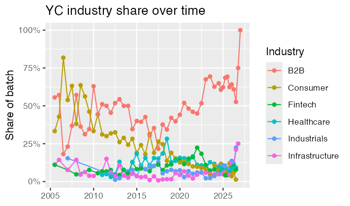
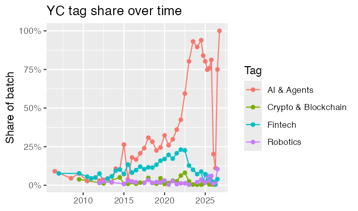

# YC Trends Analysis

Dataset, scripts, and analysis behind the article **[What 6,000 Y Combinator Startups Tell Us About Where Venture Attention Is Going](https://beyondswisspeaks.ch/YCTrends2026.html)** — a quantitative look at how Y Combinator's batch composition has shifted from 2005 to 2026.

Published by [Beyond Swiss Peaks](https://beyondswisspeaks.ch) · Simone Attanasio

---

## Repository structure

```
YC_Analysis/
├── README.md                        ← this file
├── LICENSE                          ← MIT
├── requirements.txt                 ← Python dependencies
├── .gitignore
├── data/
│   ├── yc_batch_trends.csv          ← per-batch aggregated trends (main analysis input)
│   └── yc_2027_enriched.csv         ← 6,000+ companies with founders & job openings
├── scripts/
│   ├── build_dataset.py             ← builds both CSVs from the yc-oss/api mirror
│   └── enrich_yc.py                 ← adds founders & job data by scraping YC pages
├── analysis/
│   └── yc_trends_analysis.R        ← R script for all charts in the article
└── figures/
    ├── yc-industry-share.png        ← industry share over time (used in article)
    └── yc-tag-share.png             ← AI / fintech / crypto / robotics tag share over time
```

---

## Key findings

**Industry share over time:**



**Tag share over time:**



Three shifts stand out across 6,020 companies and 50 batches:

- **AI went from theme to default.** From ~20% of each batch in Winter 2021 to over 60% by Winter 2024. "AI startup" is no longer a differentiator — it is the baseline.
- **Consumer startups nearly disappeared.** From ~33% of batches in 2012 to 4–6% in 2026. B2B broke a decade of stability at ~45% and now represents two thirds of every batch.
- **Hard tech quietly tripled.** Industrials grew from a stable ~5% to 12–14% in 2026. Robotics-tagged companies in Winter 2026 alone outnumber several full years of earlier batches.

Fintech and crypto already completed full hype cycles — both peaked around Winter 2022 and have since declined sharply, providing a base rate for how long sector dominance lasts at YC.

---

## Reproduce the dataset

### 1. Install dependencies

```bash
pip install -r requirements.txt
```

### 2. Build the base CSVs

```bash
python scripts/build_dataset.py
```

Downloads all batch JSON files from the [yc-oss/api](https://github.com/yc-oss/api) mirror and writes:
- `yc_all_companies.csv` — one row per company, all batches
- `yc_batch_trends.csv` — per-batch aggregated trends (tags, industries, regions, status)

Runtime: ~30 seconds.

### 3. Enrich with founders and job openings (optional)

```bash
python scripts/enrich_yc.py yc_all_companies.csv yc_2027_enriched.csv
```

Fetches each company's public YC profile page and adds:
- `founders` — semicolon-separated founder names
- `job_count` — number of open positions listed
- `job_titles` — semicolon-separated job titles

**Resumable:** if interrupted, rerun with the output file as input — already-enriched rows are skipped. Progress is checkpointed every 25 companies.

Runtime: ~1.7 hours for 6,000+ companies at a polite 1 request/second. Filter the input CSV to specific batches to reduce scope.

### 4. Reproduce the charts (R)

Open `analysis/yc_trends_analysis.R` in RStudio. The script reads from `data/` and writes PNGs to `figures/`. Required packages:

```r
install.packages(c("tidyverse", "ggrepel"))
```

---

## Dataset schema

### `data/yc_batch_trends.csv`

Pre-aggregated long-format table — one row per batch × dimension × value. Load directly into R or pandas for charting without further processing.

| Column | Description |
|--------|-------------|
| `batch` | YC batch name (e.g. `Winter 2026`) |
| `batch_date` | Sortable proxy date (`YYYY-MM-01`) |
| `total_companies` | Total companies in that batch |
| `dimension` | `tag` / `industry` / `region` / `status` |
| `value` | The specific tag, industry, region, or status value |
| `count` | Number of companies with this value in this batch |
| `share` | `count / total_companies` (0–1) |

### `data/yc_2027_enriched.csv`

One row per company across all 50 batches. Key columns:

| Column | Description |
|--------|-------------|
| `name` | Company name |
| `batch` | YC batch (e.g. `Winter 2026`) |
| `batch_date` | Sortable proxy date (`YYYY-MM-01`) |
| `former_names` | Previous names if the company pivoted |
| `one_liner` | Short tagline |
| `long_description` | Full company description |
| `website` | Company website |
| `yc_url` | YC profile URL |
| `industry` | Primary industry |
| `all_industries` | All industry tags, semicolon-separated |
| `tags` | YC topic tags (e.g. `AI`, `B2B`, `Robotics`) |
| `regions` | Broader regions (e.g. `US`, `Europe`) |
| `team_size` | Headcount |
| `status` | `Active`, `Acquired`, `Inactive`, etc. |
| `top_company` | YC's own "top company" flag |
| `is_hiring` | Whether the company has open roles |
| `founders` | Founder names — populated by `enrich_yc.py` |
| `job_count` | Number of open positions — populated by `enrich_yc.py` |
| `job_titles` | Open role titles — populated by `enrich_yc.py` |

---

## Data source and methodology

The base dataset comes from **[yc-oss/api](https://github.com/yc-oss/api)**, an open-source project that fetches Y Combinator's public company directory from YC's Algolia search index once a day and republishes it as static JSON files. This is not an official YC API — it mirrors publicly accessible data visible to anyone browsing [ycombinator.com/companies](https://www.ycombinator.com/companies).

Founder names and job openings are scraped from individual company pages on ycombinator.com.

**Retrieval date:** July 7, 2026.
**Companies covered:** publicly launched companies only. Stealth companies and very recent batches appear only once YC publishes them.

**Important caveat on tags:** tag coverage is complete for older batches but only ~20% filled for Winter 2026 and Spring 2026 at retrieval time. Industry classifications have 100% coverage across all 50 batches. Use `all_industries` for longitudinal comparisons.

---

## License

Scripts and analysis: MIT.
Data: derived from publicly accessible information on ycombinator.com. Please use responsibly and credit both this repository and [yc-oss/api](https://github.com/yc-oss/api).
